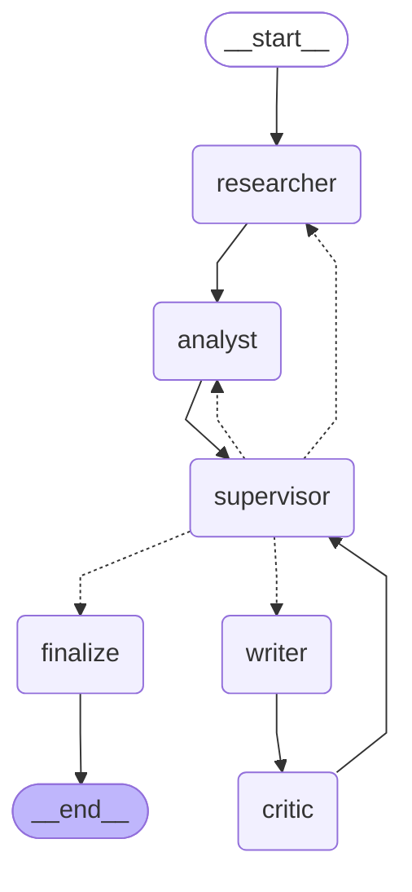

# Multi-Agent Report Writer

A controlled comparison between a single LLM agent and a multi-agent LangGraph system on
the same task: research a topic from the live web and write a cited report.

Both systems get the same six topics, the same model, the same search backend and the same
frozen rubric. The question is whether the coordination buys anything.

**On this evidence, it does not.**

---

## The result

Six topics, judged blind by `gemini-3.5-flash` in both presentation orders.

| Criterion | Single agent | Multi-agent | Delta |
|---|---:|---:|---:|
| Factual grounding | 4.67 | 4.42 | −0.25 |
| Structural coherence | 5.00 | 4.83 | −0.17 |
| Depth of analysis | 4.83 | 4.50 | −0.33 |
| Citation integrity | 4.67 | 4.42 | −0.25 |
| Absence of filler | 5.00 | 4.67 | −0.33 |
| **Mean** | **4.83** | **4.57** | **−0.27** |
| Broken citations | 0 | 0 | — |

| Cost | Single agent | Multi-agent | Multiple |
|---|---:|---:|---:|
| Total tokens | 194,618 | 246,023 | 1.26× |
| Model calls | 78 | 94 | 1.21× |
| Wall clock | 535s | 410s | 0.77× |

The multi-agent system costs 26% more tokens and scores lower on all five criteria. It is
*faster*, because the graph stops searching when the Analyst judges the evidence
sufficient while the single agent runs its full ladder every time. Neither system produced
a single broken citation.

Both write good reports. This is not a broken system — it is a more expensive one that is
not buying quality.

### Where it does pay

| Shape | n | Grounding delta | Mean delta |
|---|---:|---:|---:|
| abundant-sources | 2 | +0.00 | −0.05 |
| contested | 1 | **+1.50** | **+0.80** |
| cross-domain | 2 | −0.50 | −0.55 |
| thin-evidence | 1 | −2.00 | −1.20 |

The one clear win is the contested topic — the shape where holding two sides apart instead
of averaging them is the whole job. Contested and thin-evidence are **n=1 each**, so those
are single topics, not estimates.

### Why it loses, from three topics scored by hand

Three topics were scored blind against the same rubric, with the report-to-system mapping
hidden until all three were done.

| Criterion | Single agent | Multi-agent | Hand delta | Judge delta |
|---|---:|---:|---:|---:|
| Factual grounding | 4.00 | 4.33 | **+0.33** | −0.25 |
| Structural coherence | 3.33 | 2.33 | **−1.00** | −0.17 |
| Depth of analysis | 3.33 | 3.33 | +0.00 | −0.33 |
| Citation integrity | 4.33 | 4.00 | −0.33 | −0.25 |
| Absence of filler | 3.67 | 4.00 | **+0.33** | −0.33 |

Judge and human agree on direction — −0.27 against −0.13 — and every per-criterion gap is
under 1.0. But the composition differs. **Drop structural coherence and the other four
criteria come out at +0.09 in favour of the multi-agent.** The entire negative hand verdict
rests on one criterion.

Both free-text comments, written blind on opposite labels, independently described that
same criterion:

> *"there was no argument being created up in report 2, it was basically just facts bundled
> up in paragraphs"* — t3, `report_2` was the multi-agent

> *"report 2 was in order somewhat but report 1 was just mix of paragraphs of facts"* — t5,
> `report_1` was the multi-agent

Two topics, independent shuffles, opposite positions, the same complaint. So the finding is
narrower and more useful than "the multi-agent writes worse reports":

> **Its reports are better grounded and less padded, and they do not build an argument.
> Findings in paragraph form.**

That is consistent with the architecture — parallel researchers produce findings and the
synthesis step stacks them rather than reasoning over them — and it localises the problem
to the Writer node rather than indicting the graph.

### The gap loop does not pay for itself

35.2% of the multi-agent run goes to the Analyst→Researcher gap loop.

| Topic | Shape | Gap loops | Calls | Judge delta |
|---|---|---:|---:|---:|
| t2 | abundant-sources | 0 | 10 | −0.5 |
| t4 | contested | 1 | 16 | **+4.0** |
| t5 | cross-domain | 1 | 16 | −3.0 |
| t6 | cross-domain | 1 | 16 | −2.5 |
| t1 | abundant-sources | 2 | 18 | +0.0 |
| t3 | thin-evidence | 2 | 18 | **−6.0** |

The two topics that ran the loop hardest scored +0.0 and −6.0. The topic that never ran it
at all, on 10 calls instead of 18, scored −0.5. The loop was designed to fire where
evidence is thin; it did exactly that on t3, which is the worst result in the set. **It
fired most where it helped least.**

Loop count is confounded with topic shape across six topics, so this is a strong hint
rather than a settled result. A `--max-research-loops 0` flag would turn it into six
matched pairs and settle it.

The revision loop (Critic→Writer) is at **0% of run cost**. It has never fired at threshold
3 across three separate six-topic runs, and it did not terminate at threshold 4.

---

## What cannot be claimed

This section is load-bearing. The numbers above are weak evidence, and the honest reading
matters more than the headline.

- **The baseline sits at the ceiling.** 27 of its 30 criterion-scores are exactly 5.0 — the
  entire shortfall is one topic. The judge discriminates almost entirely by *penalising the
  multi-agent*, so −0.27 reads as "the multi-agent lost points the baseline did not", not
  as a symmetric comparison.
- **Per-shape numbers are n=1** for contested and thin-evidence.
- **One judge, six topics, three hand-scored, one human.** The direction is consistent
  across two independent instruments, which is the strongest available claim.
- **No dollar figures anywhere.** The price constants were never verified, and the cost
  *multiple* moves with the price ratio because the two systems have different input:output
  mixes. Only token multiples are rate-free.
- **The graph's limitations sections were stripped before judging.** 3 of 6 multi-agent
  reports declare unclosed evidence gaps; no baseline report ever does, because it has no
  mechanism to. That asymmetry is a format tell strong enough to defeat blinding, so it is
  removed before scoring — but criterion 1 explicitly rewards admitting missing evidence.
  The evaluation therefore removes the graph's distinguishing feature before scoring it on
  the criterion that feature exists to satisfy. Stated here as a categorical fact rather
  than folded into a score.

---

## The two systems

**Baseline** (`src/baseline/agent.py`) — one agent, one loop: plan queries, search,
extract, judge sufficiency, write. No delegation.

**Multi-agent** (`src/graph/`) — a LangGraph state machine with a routing supervisor:



That block is [`docs/graph.mmd`](docs/graph.mmd) pasted verbatim, so the two can be
diffed. It is generated by `scripts.viz` from the real graph object, not drawn by hand —
regenerate and re-paste if the topology changes. The approval-gate shape is a second
file, [`docs/graph_hitl.mmd`](docs/graph_hitl.mmd), because `build(hitl=True)` inserts a
node rather than reading a flag at runtime. Both `.png` renders are git-ignored; the
`.mmd` files are the tracked artifact.

The two dotted back-edges are the loops under test. `supervisor -.-> researcher` is the gap
loop, which buys evidence coverage. `critic → supervisor → writer` is the revision loop,
which buys prose quality. They are never averaged into one "overhead" number — they are
different products with different value.

The graph also checkpoints to SQLite, contains node failures, and supports an outline
approval gate (`--hitl`).

---

## The evaluation

The instrument was built before the experiment, and it took three attempts to get one that
works.

**Position control.** Every topic is judged in both orderings and the scores averaged. The
ordering comes from a stable `sha256`, and round 2 is the exact mirror of round 1 — not a
second random draw. Max disagreement between orderings across all six topics was **1
point**.

**Calibration.** `scripts/judge.py --calibrate` damages a clean report four known ways and
checks the judge notices on the right criterion. `gemini-3.5-flash` scored 4/4. A judge that
fails this gate makes every downstream number worthless.

**No self-judging.** The judge model must differ from the pipeline model, or the run stops.
`judge.json` records `pipeline_model` and a `self_judged` boolean, so a reader can tell from
the file alone.

**Blinding.** System names, and the "Known limitations" section, are stripped before the
judge reads anything.

**Separate evidence namespaces.** Both systems number findings from `F001` independently
and they collide completely — 67 of 67 on t1. Each report is scored against *its own*
evidence block, never a merged one. Merging them silently penalises the control on citation
integrity, in a table that looks entirely normal.

**Hand scoring.** `evals/handscore.py` shuffles the two reports per topic, writes the
mapping to a file it tells you not to open, and takes five integers each. Each report also
gets its own evidence file, so citation integrity is checkable without breaking the blind.

**Self-checks.** `evals/compare.py` runs four integrity checks on its own output — length
bias, baseline strength, judge/human agreement and loop value — and prints warnings above
the numbers rather than below them. Two of the four currently report a pass they have not
earned; both are documented in the Phase 9 write-up.

---

## Running it

Requires Python 3.12+, [uv](https://docs.astral.sh/uv/), a Gemini API key and a Tavily API
key.

```bash
cp .env.example .env    # then fill in GEMINI_API_KEY and TAVILY_API_KEY
uv sync
```

Generate reports:

```bash
uv run python -m src.run --system baseline   --all
uv run python -m src.run --system multiagent --all
uv run python -m src.run --system multiagent --topic-id t1 --hitl   # approval gate
uv run python -m src.run --resume <thread_id> --approve
uv run python -m src.run --status <thread_id>
```

Evaluate. Only the first of these spends tokens:

```bash
export GEMINI_JUDGE_MODEL=gemini-3.5-flash   # must differ from GEMINI_MODEL
uv run python -m evals.judge --repeats 2     # ~190k tokens, both orderings
uv run python -m evals.handscore             # blind, t1/t3/t5, interactive
uv run python -m evals.compare               # free — the comparison table
uv run python -m evals.handscore --reveal    # mappings, after scoring
uv run python -m scripts.cost_report         # free — cost by node and phase
```

Regenerate the committed documents. None of these spend tokens:

```bash
uv run python -m evals.compare --markdown       > docs/comparison.md
uv run python -m scripts.cost_report --markdown > docs/cost.md
uv run python -m scripts.viz                    # docs/graph.mmd
uv run python -m scripts.viz --hitl             # docs/graph_hitl.mmd
```

These are generated files. The first two go stale the moment results change, so
regenerate them in the same commit as any new run; the diagrams only change when the
graph does. The mermaid block above is a manual copy of `docs/graph.mmd` — re-paste it
when `viz` reports a change.

**Ordering matters.** `compare.py` prints hand scores mapped to their systems, so it breaks
the blind for any topic not yet scored. Score first, compare after.

`GEMINI_JUDGE_MODEL` is not in `.env.example` on purpose — setting it in the shell keeps the
choice of judge visible in the command rather than buried in a file.

---

## Layout

| Path | What it holds |
|---|---|
| `src/baseline/` | The single-agent control |
| `src/graph/` | The LangGraph system — nodes, state, checkpointing, retry |
| `src/common/` | Shared LLM, search, schemas and run-record I/O |
| `src/analysis/` | Cost attribution by node, phase and call type |
| `evals/` | The judge, the comparison, blind hand-scoring, the frozen rubric |
| `scripts/` | Calibration, pairwise judging, chaos and resume demos, backfills |
| `data/topics.json` | The six frozen topics, with a pre-registered trap for each |
| `results/` | Reports, run records, judge output, hand scores |
| `docs/comparison.md` | Generated — the comparison table, with its own integrity checks |
| `docs/cost.md` | Generated — cost breakdown, tokens and ratios only |
| `docs/graph.mmd` | Generated — graph topology, and `graph_hitl.mmd` with the approval gate |

Every run record carries the commit it was produced at, and `cost_report` refuses to read a
set spanning more than one code version as a single measurement.

The six topics are frozen, and each carries a pre-registered trap — a specific way a report
can look good and be wrong. t1's is announced pilot capacity versus deployed capacity;
t3's is drifting back to the three countries the question excludes. Naming them before
either system ran is what stops the evaluation from deciding after the fact what counts as
a flaw.

---

## Write-ups

Each phase has a walkthrough in `analysis/` (git-ignored local artifacts). Phase 9 covers
the judge, the six defects found in it before it produced a number, the run, the hand
scores, and the two integrity checks that reported a pass they had not earned.
